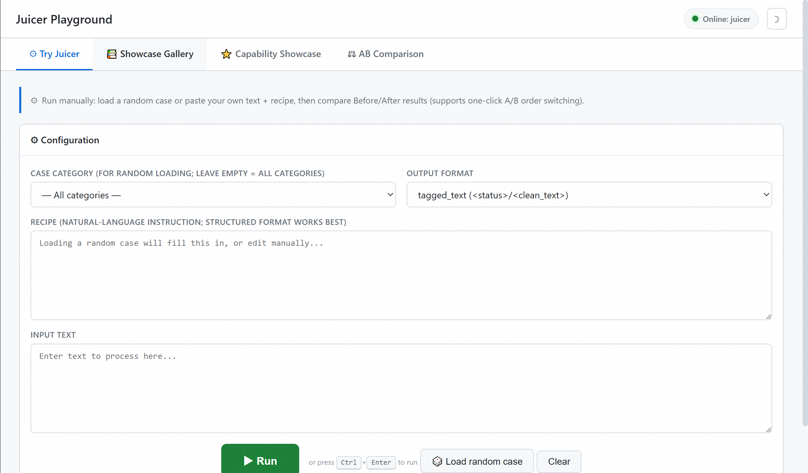
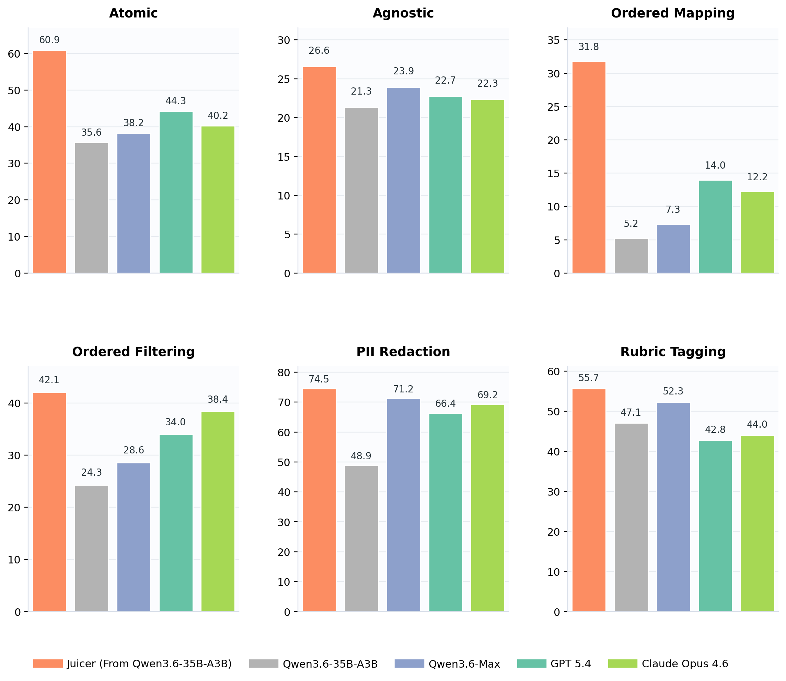

# Juicer

> Natural-language data-refinement model · Built on Qwen3.6-35B-A3B · Locally deployable

**Source:** [`data-juicer-hub/juicer_playground`](https://github.com/datajuicer/data-juicer-hub/tree/main/juicer_playground)

**Juicer** turns cleaning instructions, filtering rules, and semantic-tagging requirements into strict tagged text or canonical JSON. It is not a general chat model; it is designed for data-refinement workflows.

Evaluated on [CDR-Bench](https://github.com/lukahhcm/data-juicer-hub/tree/CDR-Bench).

## Highlights

- **Natural-language recipe execution** — for example, remove emails, deduplicate sentences, and normalize whitespace.
- **Order-sensitive refinement** — distinguishes filtering before cleanup from filtering after cleanup and tracks intermediate state.
- **Structured semantic tagging** — rubric and related tasks can return JSON under a defined schema.
- **Local deployment** — supports processing sensitive data in your own environment.

## Quickstart

### 1. Start the model

Juicer is not tied to a specific inference framework. We recommend deploying it as an OpenAI-compatible service for use by the Playground and data-processing jobs.

#### Recommended: vLLM service

On a single H20 (96GB), use the included launcher:

```bash
export MODEL_ID=/path/to/juicer-model
bash serve.sh --model "$MODEL_ID" --port 8000
```

#### Optional: SGLang service

Install SGLang for your accelerator environment by following the [official installation guide](https://docs.sglang.io/docs/get-started/install), then launch:

```bash
export MODEL_ID=/path/to/juicer-model
python -m sglang.launch_server \
  --model-path "$MODEL_ID" \
  --served-model-name juicer \
  --port 8000 \
  --trust-remote-code
```

#### Optional: local Transformers loading

This approach calls the model directly from Python without starting a service:

```bash
pip install "transformers>=5.3" accelerate
export MODEL_ID=/path/to/juicer-model
```

```python
import os
from transformers import AutoModelForImageTextToText, AutoTokenizer

model_id = os.environ["MODEL_ID"]
tokenizer = AutoTokenizer.from_pretrained(model_id, trust_remote_code=True)
model = AutoModelForImageTextToText.from_pretrained(
    model_id,
    torch_dtype="auto",
    device_map="auto",
    trust_remote_code=True,
)

messages = [{"role": "user", "content": "Remove email addresses from: Contact ops@example.com."}]
inputs = tokenizer.apply_chat_template(
    messages,
    tokenize=True,
    add_generation_prompt=True,
    enable_thinking=False,
    return_tensors="pt",
    return_dict=True,
).to(model.device)
prompt_length = inputs["input_ids"].shape[-1]
outputs = model.generate(**inputs, max_new_tokens=4096, do_sample=False)
print(tokenizer.decode(outputs[0, prompt_length:], skip_special_tokens=True))
```

### 2. Open the Playground



The Playground can connect to any OpenAI-compatible model service:

```bash
pip install -r requirements.txt
export JUICER_BASE_URL=http://localhost:8000/v1
python app.py
# open http://localhost:7860
```

The Playground is a single-page app with no build step and four tabs:

| Tab | Purpose |
|-----|---------|
| **Try Juicer** | Load a random case or run custom text and a recipe |
| **Showcase Gallery** | Browse 51 examples, inspect details, or load one into the try page |
| **Capability Showcase** | Explore core capabilities through representative examples |
| **AB Comparison** | *(Optional)* Compare the base model and Juicer side by side |

### AB Comparison (optional)

https://github.com/user-attachments/assets/d5abe057-5535-4629-a3dc-a9ccd4328c1d

If multiple GPUs are available, you can run Juicer and the base model at the same time to experience their behavior on the same recipe. Adjust GPU allocation through the launcher options to suit the machine.

```bash
bash serve_ab.sh \
  --juicer /path/to/juicer-model \
  --raw /path/to/Qwen3.6-35B-A3B

export JUICER_RAW_BASE_URL=http://localhost:8001/v1
python app.py

bash serve_ab.sh --stop
```

See [tutorial.md](tutorial.md) for detailed steps.

## Capabilities

| Type | Meaning | Example |
|------|---------|---------|
| Atomic | Single-step mapper or filter | Remove URLs; keep only English text |
| Compositional | Multiple refinement steps in one pass | Remove emails, deduplicate, and normalize whitespace |
| Order-sensitive | Execution order that respects intermediate state | Filter before cleanup versus after cleanup |
| Semantic | PII redaction, rubric scoring, and safety tagging | Redact identifiers; return structured scores |

CDR-Bench and the showcase cases focus on these core operators:

- **text mappers:** link cleanup, comment/reference removal, duplicate-sentence removal, and whitespace and formatting normalization
- **filters:** text/word length, repetition ratio, stopword ratio, and related quality filters
- **PII operators:** contact, location, temporal, identity, and person-related redaction
- **semantic operators:** hallucination detection/correction, rubric scoring, and classification tagging

## Showcase Cases

https://github.com/user-attachments/assets/fab770dc-318a-4f63-90aa-edbbfb4c23e0

The `cases/` directory contains 51 showcase cases grouped by CDR-Bench capability:

| Category | File | Count | Content |
|----------|------|-------|---------|
| Atomic Mapper | `atomic_mapper.jsonl` | 6 | Single-step text transforms |
| Atomic Filter | `atomic_filter.jsonl` | 5 | Single-step filtering decisions |
| PII Redaction | `pii.jsonl` | 10 | Name/contact/address/ID/temporal redaction |
| Hallucination | `hallucination.jsonl` | 5 | Hallucination detection and correction |
| Rubric Scoring | `rubric.jsonl` | 4 | HelpSteer2 dimension scoring |
| Safety | `safety.jsonl` | 6 | Aegis safety classification |
| Order-sensitive | `order_sensitive.jsonl` | 8 | Ordered multi-operator execution |
| Compositional | `compositional.jsonl` | 7 | Multi-step end-to-end workflows |

All cases share a unified schema; see [cases/README.md](cases/README.md).

## Integration Code

```bash
python examples/single_clean.py   # single request
python examples/batch_clean.py    # batch cleaning
python examples/pii_redact.py     # PII redaction
```

`adapter.py` provides APIs such as `build_prompt_from_row(row)` and `parse_output(text, output_format)`. See [examples/README.md](examples/README.md).

## Model Overview

| Item | Description |
|------|-------------|
| Base model | [Qwen/Qwen3.6-35B-A3B](https://huggingface.co/Qwen/Qwen3.6-35B-A3B) |
| Architecture | Qwen3.6 MoE causal LM; 35B total / 3B activated parameters |
| Output contracts | Tagged text or task-specific canonical JSON |
| Evaluated serving length | 32,768 tokens |
| Inherited context configuration | 262,144 tokens; quality beyond 32K was not evaluated |

> When supported by the serving framework, disable thinking with `chat_template_kwargs.enable_thinking=false`.

## Evaluation



## Limitations

- Data-refinement quality beyond 32K tokens has not been evaluated.
- Juicer should not directly replace deterministic tools or human review in high-precision or compliance-critical workflows.

## Citation

```plain
@misc{juicer2026,
  title        = {Juicer: Natural-Language Data Refinement with Qwen3.6-35B-A3B},
  author       = {Juicer Contributors},
  year         = {2026},
  howpublished = {Hugging Face model release}
}
```

Juicer builds on [Qwen3.6-35B-A3B](https://huggingface.co/Qwen/Qwen3.6-35B-A3B) and uses [CDR-Bench](https://github.com/lukahhcm/data-juicer-hub/tree/CDR-Bench), [Data-Juicer](https://github.com/datajuicer/data-juicer), and [Trinity-RFT](https://github.com/agentscope-ai/Trinity-RFT).

## License

Apache License 2.0, inherited from the Qwen3.6-35B-A3B base model.
